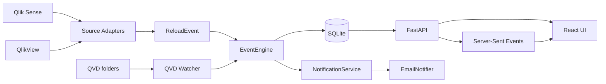

# Qlik Reload Monitor

> Real-time reload observability for Qlik Sense and QlikView.

Qlik Reload Monitor is a read-only observability layer for Qlik reloads. It makes reload execution visible in real time, tracks QVD growth on disk, keeps a detailed reload history, and surfaces warnings, failures, and notification status.


---

## Overview

A Qlik reload can succeed, slow down, partially fail, or produce unexpected QVD volumes without giving operations teams a consolidated view of what actually happened.

Qlik Reload Monitor answers questions such as:

- Which Qlik application or document is reloading?
- Which script section is currently running?
- Which table is being loaded?
- How many rows have been processed?
- Which QVD is being written?
- How fast is the QVD growing?
- When does the QVD become stable?
- Which warnings or errors occurred?
- How long did each stage take?
- What happened during a previous reload occurrence?

The project is deliberately **read-only toward Qlik**.

It does not start, stop, modify, or delete:

- reloads;
- Qlik applications;
- QlikView documents;
- QVD files;
- Qlik logs.

---

## Current status

### Implemented

- Normalized reload event model
- SQLite persistence and schema migrations
- Event deduplication with monotonic sequence numbers
- Reload-state reconstruction after restart
- Read-only QVD watcher based on filesystem metadata
- QVD size evolution tracking
- `QVD_STABLE` event
- Demo scenarios: `successful`, `slow`, `error`
- FastAPI read-only API
- Server-Sent Events with resume after disconnection
- React + TypeScript frontend
- LIVE RELOAD view
- Expandable reload history
- Reload detail by occurrence
- Warning and error tracking
- QVD `WRITING` / `STABLE` states
- Platform model: `demo`, `qlik_sense`, `qlik_view`
- Email notification workflow on failed reloads
- Notification deduplication
- Email dry-run mode

### Next

- Real Qlik Sense log adapter
- Real QlikView log adapter
- Permanent collector process
- Log rotation and locked-file handling
- Reload interruption detection
- Automatic QVD-to-reload correlation
- Windows service packaging
- Production authentication and HTTPS
- Dedicated Performance view
- Dedicated QVD Monitor view

> Qlik Sense and QlikView are already supported by the normalized data model. Real production log ingestion is the next milestone.

---

## Architecture



### Design principle

Both Qlik Sense and QlikView are converted into the same normalized event model.

```text
Qlik Sense / QlikView
        |
        v
   Source Adapter
        |
        v
    ReloadEvent
        |
        v
    EventEngine
        |
        v
      SQLite
        |
        +------> FastAPI / SSE ------> Frontend
        |
        +------> Notifications
```

The frontend does not need platform-specific parsing logic.

---

## Event model

Typical event types:

```text
RELOAD_START
RELOAD_END

SECTION_START
SECTION_END

TABLE_START
TABLE_PROGRESS
TABLE_END

QVD_WRITE_START
QVD_SIZE_CHANGE
QVD_WRITE_END
QVD_STABLE

WARNING
ERROR
```

Each event receives a monotonic sequence number used for:

- ordering;
- deduplication;
- SSE resume;
- restart recovery.

---

## LIVE RELOAD

The LIVE view exposes the current execution state.

```text
Application      VENTES
Platform         Qlik Sense
Status           RUNNING
Started          18:50:02
Elapsed          00:01:04

Section          FACTS
Current table    VENTES
Current rows     742 184

Current QVD      VENTES.qvd
Current size     16.0 MB

Warnings         0
Errors           0
```

Example timeline:

```text
18:50:02  Reload started
18:50:03  Section DIMENSIONS
18:50:06  CLIENTS completed - 42 318 rows
18:50:06  CLIENTS.qvd writing
18:50:12  CLIENTS.qvd stable - 4.6 MB
18:50:18  Section FACTS
18:50:18  VENTES loading
18:50:55  VENTES completed - 1 842 556 rows
18:51:03  VENTES.qvd stable - 31.8 MB
18:51:05  Reload completed
```

No progress percentage is invented for a QVD when its final size is unknown.

---

## Reload history

Every reload occurrence is stored independently.

Example:

```text
01/10/2026 22:47:15 | Qlik Sense | VENTES | ERROR   | 1m12s | 737 022 rows
01/10/2026 22:31:04 | Qlik Sense | VENTES | SUCCESS | 1m03s | 1 893 300 rows
```

A reload can be expanded to inspect:

1. reload summary;
2. script sections;
3. tables;
4. QVD writes;
5. warnings;
6. errors;
7. notifications;
8. full event chronology.

Historical details are loaded on demand.

---

## QVD monitoring

The watcher is read-only and uses filesystem metadata.

It observes:

- file creation;
- file-size changes;
- size deltas;
- stabilization;
- rewriting after stabilization.

Example:

```text
VENTES.qvd

Status          WRITING
Current size    16.0 MB
Last delta      +4.0 MB
Last measure    18:50:59
```

Then:

```text
VENTES.qvd

Status          STABLE
Final size      31.8 MB
Stable at       18:51:05
```

---

## Failure alerts

A failed reload can generate one email notification per reload occurrence.

Example subject:

```text
#Error Reload QlikSense | VENTES | 01/10/2026 22:47
```

The body can include:

- platform;
- application or document;
- reload ID;
- start and end time;
- elapsed time;
- current section;
- current table;
- last known row count;
- current QVD;
- last observed QVD size;
- error message;
- warning count.

Email secrets are never stored in the repository.

---

## Repository structure

```text
qlik-reload-monitor/
├── config.yaml
├── backend/
│   ├── app/
│   │   ├── api/
│   │   ├── demo/
│   │   ├── engine/
│   │   ├── models/
│   │   ├── notifications/
│   │   ├── storage/
│   │   └── watcher/
│   └── tests/
└── frontend/
    └── src/
        ├── api/
        ├── components/
        ├── hooks/
        ├── lib/
        └── test/
```

---

## Requirements

### Windows

- Python 3.11+
- Node.js 22.12+
- PowerShell

---

## Installation

From the repository root:

```powershell
cd backend
py -m venv .venv
.\.venv\Scripts\Activate.ps1
pip install -r requirements-dev.txt

cd ..\frontend
npm install
```

---

## Development

### Terminal 1 - API

```powershell
cd backend
.\.venv\Scripts\Activate.ps1
python -m app.api
```

API:

```text
http://127.0.0.1:8000
```

OpenAPI documentation:

```text
http://127.0.0.1:8000/docs
```

### Terminal 2 - Frontend

```powershell
cd frontend
npm run dev
```

Frontend:

```text
http://127.0.0.1:5173
```

### Terminal 3 - Demo reload

From `backend` with the Python environment activated:

```powershell
python -m app.demo successful --speed 5
python -m app.demo slow --speed 5
python -m app.demo error --speed 5
```

---

## Production-like local build

The compiled frontend can be served directly by FastAPI.

```powershell
cd frontend
npm run build

cd ..\backend
.\.venv\Scripts\Activate.ps1
python -m app.api
```

Application:

```text
http://127.0.0.1:8000
```

---

## Tests

### Backend

```powershell
cd backend
pytest
```

### Frontend

```powershell
cd frontend
npm test
npm run build
```

---

## Configuration

Local or secret values must stay outside Git.

Expected environment variables include:

```text
ALERT_EMAIL_RECIPIENT
SMTP_HOST
SMTP_PORT
SMTP_USERNAME
SMTP_PASSWORD
SMTP_FROM
```

Example:

```powershell
$env:ALERT_EMAIL_RECIPIENT = "your-email@example.com"
$env:SMTP_HOST = "smtp.example.com"
$env:SMTP_PORT = "587"
$env:SMTP_USERNAME = "your-user"
$env:SMTP_PASSWORD = "your-app-password"
$env:SMTP_FROM = "monitor@example.com"
```

Never commit real credentials.

---

## Security model

Qlik Reload Monitor is designed as an observation layer.

### Read-only toward Qlik

The application must not:

- trigger a reload;
- stop a reload;
- edit a Qlik application;
- edit a QlikView document;
- edit or delete a QVD;
- edit a Qlik log.

### Repository hygiene

The public repository must not contain:

- `.env`;
- SMTP credentials;
- absolute personal paths;
- local usernames;
- local SQLite databases;
- generated demo data;
- Python virtual environments;
- `node_modules`;
- frontend build output;
- local runtime logs.

---

## Runtime persistence

Runtime persistence is intentionally local and excluded from Git.

Typical generated data:

```text
data/
demo_data/
*.db
*.sqlite
*.sqlite3
*.log
```

These files can contain reload history and must never be included in the public repository.

---

## Roadmap

- [x] Normalized event model
- [x] Event engine
- [x] SQLite event store
- [x] QVD watcher
- [x] Demo simulator
- [x] FastAPI
- [x] SSE
- [x] LIVE view
- [x] Expandable reload history
- [x] Failure notifications
- [ ] Qlik Sense adapter
- [ ] QlikView adapter
- [ ] Permanent collector
- [ ] Windows service packaging
- [ ] Authentication / HTTPS
- [ ] Performance view
- [ ] Dedicated QVD Monitor view

---

## Project status

**Functional prototype / technical demonstrator.**

The current version validates the observability architecture and the user experience using deterministic demo reloads.

The next milestone is real Qlik Sense and QlikView log ingestion.

---

## Disclaimer

Qlik Reload Monitor is an independent technical project and is not an official Qlik product.
